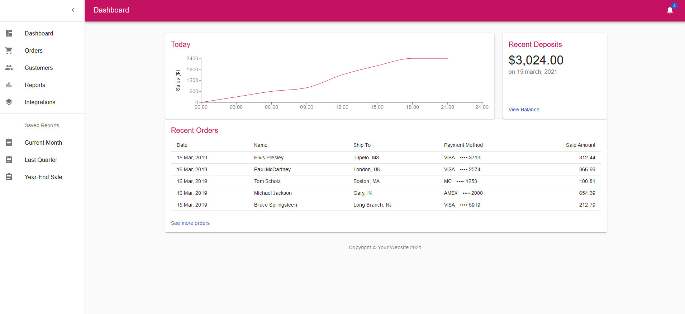

# Dashboard Demo




Built using React, Material-ui, and axio this dashboard demonstrations shows capabilities for dynamic graph data, notification integration as well as fetched and displayed financial data with a sliding left side menu for various web pages and features you could ever need!

## Running Locally

Too run locally clone the repo, install dependencies and thats it! Axios is pulling from jsonplaceholder for the images and notifications. Financial data is hard coded but will be dynamically generated in the future.

```
   > git clone https://github.com/M-Daley/dashboard
   > cd dashboard
   > npm install & npm run start
```